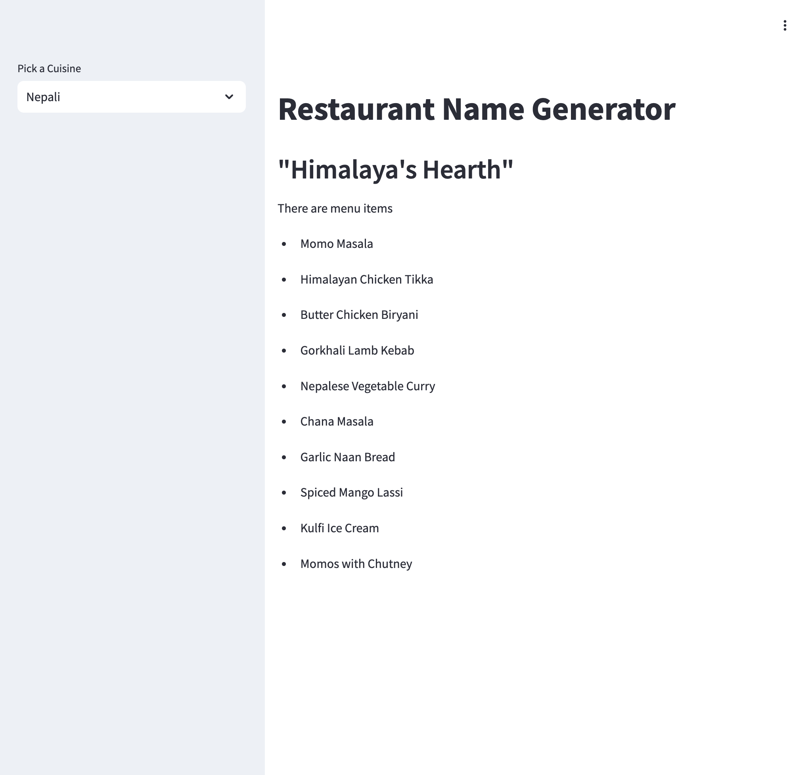

## Restaurant Name Generator Project RAG project
### ollama x langchain x streamlit x llm x RAG

{width=5000}

**Summary**
1. Generate a name of a restaurant based on the `name` of the cuisine - name - Italan, Mexian, Nepali, Indian etc.
2. Generate `10 menu items` based on the `name` of the restaurant

**Setup**
1. Ollama
    * Download and install Ollama - [Ollama Website](https://ollama.com/)
    * Download one of the models from the ollama and run it. I am using `llama3`
```
ollama pull llama3
```
run the ollama in background

2. Install the requirements
   ```
   pip install -r requirements.txt
   ```
3. Run the streamlit app
   ```
   streamlit run app.py
   ```

Note: This project is inspired from the Codebasic youtube channel tutorial.
